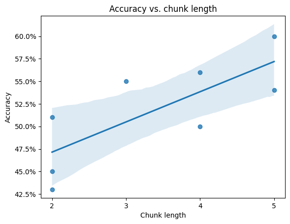
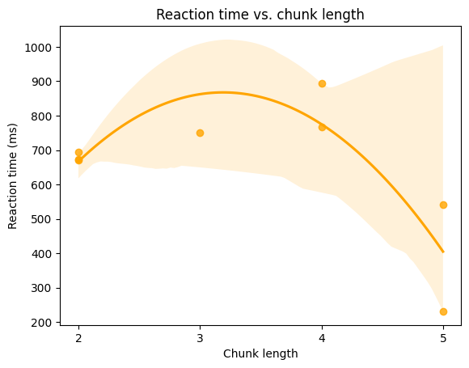
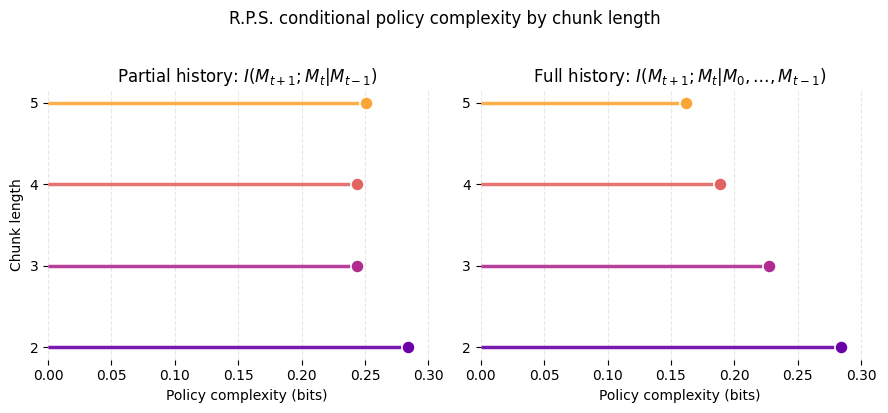

## abstract
> Chunking is a strategy for grouping units of information in memory, and is widely believed to reduce cognitive load under working memory constraints. A recent line of research attempts to formalize chunking in terms of Shannon information. Lai and others argue that an agent's policy can be modeled as a noisy communication channel (2021) in which the agent optimizes a tradeoff between fidelity and bitrate. Using a simple stimulus-response task (2025), the same authors provide evidence that chunking in humans occurs due to the cost imposed by a quantity they term _conditional policy complexity_, the mutual information between state and action conditioned on a single discrete timestep of state history. We attempt to both replicate and extend this finding by producing evidence that chunking occurs in more complex scenarios due to a constraint on policy complexity conditioned on _multiple_ previous timesteps.

## intro/background
### an overview of chunking
- mention miller's landmark paper, "the magical number seven, plus or minus two"
- reaction time in the sequential condition of the serial reaction time task (SRTT) is lower (Dezfouli, 2012)
- CHREST, a computational model of chunk learning, has been used to successfully predict patterns of behavior observed during chess games (Gobet, 2001)
### chunking as policy compression
- policy complexity $I(S;A)$ is first proposed as a way to model suboptimal learning in schizophrenic patients (Lai and others, 2021)
- conditional policy complexity $I(S_t;A|S_{t-1})$ models the trend of higher accuracy and lower RT in a variant of the SRTT (Lai and others, 2025)
- key question: how does performance in a game which requires attending to state at _multiple_ previous discrete timesteps relate to policy complexity conditioned on all relevant state history?
- hypothesis: accuracy and RT in our task will be positively and negatively correlated, respectively, with chunk length

## methods
- overview of RPS task:
    > Our task consisted of 100 rounds of Rock Paper Scissors against a computer opponent which plays according to a partially deterministic hidden policy. The policy is defined by the chunk length L and key move K such that the bot chooses random moves with uniform probability until it plays K, at which point it begins a deterministic sequence of L moves. After finishing the chunk sequence, it returns to random play.
    >
    > In order to distinguish between fully random rounds and rounds for which the user may be expected to anticipate the bot’s action, we assign each move an integer _policy phase_ φ such that for randomly chosen moves the round is designated with φ = 0, and for chunked moves that follow K, φ is in {1, … L - 1}.
- the primary variables we measured were reaction time and accuracy. accuracy was defined as the average win rate for rounds such that φ > 0 (i.e. rounds for which there was a deterministic outcome)
- because our hypothesis rests on the assumption that participants would successfully learn and apply the optimal policy over the course of the experiment, we restricted our analysis to participants that scored at least 70% accuracy in the second half of rounds
- originally, we intended for a between-subjects design in which each participant was randomly assigned to one of four conditions for $L \in [2, 3, 4, 5]$. however, due to constraints on the number of participants we were able to recruit, we allowed participants to submit multiple responses.
- after learning that one participant cheated by inspecting the javascript console in the browser during the experiment, we excluded all responses with greater than 95% accuracy
- conditional policy complexity for our bot's hidden policy (see discussion) was calculated exactly by enumerating all possible policy variants, and independently verified using a simulation of 30k rounds x 256 random policies per chunking condition
- source code for the task and data analysis are published at https://github.com/kristen-lee-120/rps

## results

- we recruited a convenience sample of volunteers for a total of 48 responses. after narrowing the responses as described in the methods section, we were left with 8 valid responses (see discussion regarding sample size)
- accuracy and chunk length were positively correlated ($R^2 = 0.585$, $p = 0.027$)
- reaction time and chunk length had an inverse U-shaped relationship, peaking at chunk length 3 ($R^2 = 0.722$, $p = 0.041$)
- these results confirm our hypothesis, with the exception of the somewhat lower than expected reaction times at shorter chunk lengths. this may be due to the relative ease with which the shorter sequences were learned by participants

## discussion
### implications for conditional policy complexity

- we define the policy complexity for the computer opponent in our game of Rock, Paper, Scissors as $I(M_t;M_{t+1})$ where $M_t \in [\text{Rock}, \text{Paper}, \text{Scissors}]$ is the move chosen at timestep $t$
- in order to fully predict the opponent's subsequent move, the player needs to condition on the key move, because it signals the policy phase
- crucially, our four hidden policy conditions are stratified by full-history conditional policy complexity $I(M_t;M_{t+1}|M_0 \ldots M_{t-1})$, whereas single-stage conditional policy complexity $I(M_t;M_{t+1}|M_{t-1})$ is insufficient to distinguish our conditions (see `paper/plots/cpc.png`).
- therefore, any systematic differences in accuracy or RT point to multi-stage conditional policy complexity as the main driver of complexity cost
### limitations
- very few responses after filtering for minimum acceptable accuracy criterion
- after some early feedback, we learned that many participants didn't fully understand the nature of the game, specifically the rules by which the computer opponent played the game. we clarified the instructions after reviewing feedback, but earlier repsonses may have been noisier due to poor understanding of the task 
